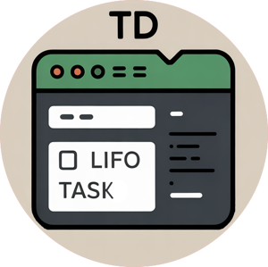

🔖 **td** is a minimal, context-aware todo list manager for the command line, written in Bash.

Unlike standard todo lists, `td` captures the **context** of your task. It records the working directory (or Git root) and optionally a specific file associated with the task. It operates on a stack (LIFO) or queue (FIFO) basis, designed to help developers push tasks onto a stack to clear their mental buffer and pop them off later to resume work.

## Features

*   **Context Aware**: Automatically records the project root or current directory.
*   **Context Actions**: List and execute tasks specifically for the current directory using `td . [N]`.
*   **File Linking**: Associates tasks with specific files (e.g., `td main.py "Refactor this"`).
*   **Stack Semantics**: Defaults to LIFO (Last In, First Out) to handle interruptions immediately.
*   **Searchable**: Filter tasks by text, filename, or directory path.
*   **Safe**: Built-in Undo, history management, and on-demand backups.
*   **History**: Deleted and completed tasks are saved to a history file. You can search, restore, or selectively delete history items.
*   **Zero Dependencies**: Relies only on standard tools (`bash`, `date`, `sed`, `grep`, `awk`).
*   **Clean Interface**: Formatted output with abbreviated paths (e.g., `~/src/project`).

## Installation

```bash
git clone --depth 1 https://github.com/psqlmaster/td.git && \
cd td && sudo cp td /usr/local/bin && sudo chmod +x /usr/local/bin/td && td H
```

## Usage

### Adding Tasks (Push)

You can add a task by simply typing the message.

```bash
td Update nginx config
```

If the first argument is an existing file, `td` links the task to that file.

```bash
td server.js "Fix memory leak in loop"
```
*Shortcuts: `a`, `add`, `push`*

### Listing Tasks (List)

Displays all tasks with their ID, timestamp, linked file, and directory context.

```bash
td l
# or just `td` if DEFAULT_ACTION=list
```

**Output example:**
```text
ID   Date          File            Task
1    01-08 10:15   --              Review PR #42 (~/work/backend)
2    01-08 11:30   server.js       Fix memory leak (~/work/backend)
3    01-08 12:00   styles.css      Adjust padding (~/work/frontend)
```
*Shortcuts: `l`, `list`*

### Context Actions (Here)

You can work strictly within the current directory context using the `.` command.

1.  **List local tasks:**
    ```bash
    td .
    ```
    Shows tasks only for the current folder (numbered 1, 2, 3... based on your `LIST_ORDER`).

2.  **Do a specific local task:**
    ```bash
    td . 2
    ```
    Executes the 2nd task from the *visible local list*. `td` automatically calculates the real Global ID for you.

3.  **Do the next local task:**
    ```bash
    td . n
    ```
    Executes the 1st task from the visible local list (alias for `td . 1`).

*Shortcuts: `.`, `here`*

### Completing Tasks (Next / Do)

You can retrieve/finish tasks globally using the standard `next` command.

**1. Automatic (Context & Stack)**
Retrieves the top task based on your stack settings (LIFO/FIFO) and current directory priority.

```bash
td n
```

**2. Specific Task**
Retrieves a specific task by its **Global ID** (from the main `list` command).

```bash
td n 54
```

**Output example:**
```text
>>> NEXT TASK: Fix memory leak
Dir:  cd ~/work/backend
File: server.js
Cmd:  vim server.js
```
*Shortcuts: `n`, `next`, `do`, `pop`*

### Searching Tasks

Filter tasks by keyword. `td` performs a case-insensitive search across the task description, filename, and path.

```bash
td s "memory"
```

If you provide a search term, `td` will also search the **history** of removed/completed tasks and print matches in a distinct color. This lets you find previously deleted items without restoring the full list.

*Shortcuts: `s`, `search`, `find`*

### Removing Tasks

To delete tasks by ID without "doing" them. You can delete multiple tasks at once.

```bash
td rm 2 4 5
```

### History & Undo

`td` keeps an append-only history of removed or completed tasks in `~/.config/td/td.lst.hist`.

**Viewing History:**
```bash
td h
# or
td history
```

**Undo (Restore):**
If you accidentally deleted a task, you can revert it.
```bash
td u        # Undo last change (step-wise)
td u 12     # Restore specific History ID (HID) 12
```

**Cleaning History:**
You can permanently remove items from history.
```bash
td rmh 1 5  # Remove history items with HID 1 and 5
td ch       # Clear ALL history (permanent)
```

### Backup

You can quickly create a backup of your configuration and todo list.

```bash
td b
```
This prompts for confirmation and creates a `.tar.gz` archive of your `~/.config/td` directory in your **current working directory**.

*Shortcuts: `b`, `bak`, `backup`*

### Clearing the List

To remove all active tasks (moves them to history):

```bash
td clear
```

## Configuration

On the first run, `td` creates a configuration file at `~/.config/td/tdrc`. You can edit this file to change the default behavior.

```bash
# ~/.config/td/tdrc

# Default action when running 'td' without args: 'help' or 'list'
DEFAULT_ACTION=list

# Queue mode: 'lifo' (stack) or 'fifo' (queue)
QUEUE_MODE=lifo

# If true, 'pop'/'next' will only show tasks from the current directory context
PROJECTS_ONLY=false

# If true, 'pop'/'next' will not delete the task from the list automatically
PRESERVE_QUEUE=false

# Display order for `td l` / `td` list.
# 'asc' = oldest first (default)
# 'desc' = newest first
LIST_ORDER=desc
```

You can also override options for a single command:
```bash
LIST_ORDER=asc td .
```
